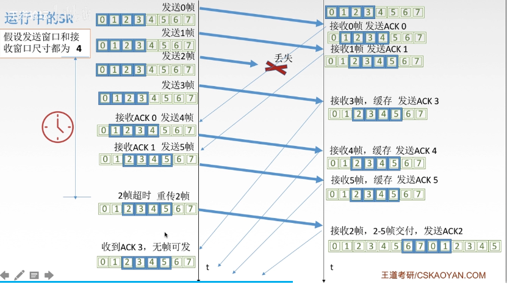

# 一

计算机网络：互连、自治的计算机的集合

==速率==即数据率或者比特率 1kb/s=10^3^b/s 当表示速率的时候就是10^3^

==带宽==原本之某个信号具有的频带宽度，即最高频率与最低频率之差，单位为Hz，计网中指单位时间内从某一点到另外一点的最高数据率，和传输速率无关（与介质有关），带宽指一端的数据能力

==吞吐量==单位时间内通过某个网络的数据量，受网络带宽或者网络的额定速率的限制

==时延==

- 发送时延（传输时延） =  数据长度/信道带宽
- 传播实验 取决于电磁波传播速度和链路速度  =信道长度/电磁波速率
- 排队时延 等待输出/入链路可用
- 处理时延 检错 找出口

==时延带宽积== 时延×带宽

==往返时延RTT== 从发送到得到对方确认的时延 包括2*传播时延 和 对方处理时延

==利用率== 信道利用率 = 有数据通过时间/总时间 网络利用率 信道利用率的加权平均

==OSI== 理论成功，市场失败。

通信的过程，发送端：应用层包装data和head传给表示层，表示层又将其加上一个head传给会话层，会话层又加个head，将其得到的又加head，传输层和网络层如此，数据链路层要加head和tail，物理层直接二进制。接收端反过来

应用层：所有能和用户交互产生网络流量的程序

表示层：处理交换信息的表示方式。功能一：数据格式变换。功能二：加密解密。功能三：数据压缩恢复

会话层：向表示层/用户进程提供建立连接并在连接上有序地传输数据

传输层：负责主机中两个进程地通信，即端到端地通信，传输单位是报文段或者用户数据报

网络层：把分组从源端传到目的端，为分组交换网上地不同主句提供通信服务。基本单位是数据报

- 路由选择 选择路径
- 流量控制
- 差错控制
- 拥塞控制

数据链路层：把网络层传下来地数据报组装成帧，传输单位为帧

- 成帧
- 差错控制
- 流量控制
- 访问（接入）控制

物理层：在物理媒体上实现比特流地透明传输


TCP/IP

应用层(FTP SMTP HTTP) 传输层(TCP UDP) 网络层(IP ICMP) 网络接口层(Ethernet PPP)

对用网络协议栈


# 二

通信方式

- 单工通信
- 半双工通信
- 全双工通信

传输方式

- 串行传输
- 并行传输

码元（符号）指用一个固定时长的==信号==波形（数字脉冲），代表==不同离散数值==的基本波形

波特：码元/time


奈式准则和香农定理


基带信号和宽带信号

- 基带信号 将数字信号1和0直接用两种不同的电压表示，再送到数字信道上传输（基带传输） 距离近
- 宽带信号 将基带信号调制后的频分复用模拟信号，送到模拟信道上传输（宽带传输）距离远

编码与调制

- 转为 数字信号 编码 PCM编码器
- 转为 模拟信号 调制 放大器调制器


数字数据编码成数字信号

1. 非归零编码 高1低0 容易实现但无检错无法判断一个码元的开始和结束（一连串的0或者1是一条直线，不知道如何区别）难以同步（要一个timer）
2. 归零编码 在一个码元之类都要恢复为0 在1中前部分高电平，后部分低电平
3. 反向不归零编码 信号电平翻转表示0 不变表示1 全1的话就不好
4. 曼切斯特编码 把一个码元分成两个相等的间隔，前一个间隔为低后一个为高表示1，0则相反  特点是中间有电平跳变，可以做时钟信号和数据信号，但是需要两倍基带带宽，数据为一半
5. 差分曼切斯特编码 同1异0 如码元为1则前半个码元的电平与上一个码元的后半个码元电平相同 

6. 4B/5B  比特流中插入额外的比特以打破一连串的0或者1


数字数据编码成模拟信号

调幅 调配 调相

调幅+调相（QAM）

eg. 波特率为1200Baud 采用4个相位 每个相位4种振幅 信息传输速率是多少

4*4 = 16， log16 = 4(要用多少个bit表示这16种状态)， 1200\*4 = 4800b/s


模拟调制数字

抽样 周期性扫描 把连续信号转为离散  f~采样~>2f~信号最高频率~

量化 电平幅值转为数字 取整

编码 转为二进制


数字调制模拟


传输介质

- 导向性 沿介质
- 非导向 

双绞线

- 非屏蔽（UTP） 并排绞合 根据右手准则，相互抵消电磁干扰
- 屏蔽（STP）加个金属丝编制成的屏蔽层

同轴电缆

光纤


中继器 （对信号再生和还原）对衰减的信号加强

集线器 对一个输入信号，放大后传给其他所有


# 三

帧的结构 ： 首部 数据 尾部

1. 字符计数，帧首部使用一个计数字段表示帧的长度
2. 字符填充， 若数据部分中有表示帧开始和结束的字符就要用个填充字符（转移字符）避免误会
3.  零比特填充 发送端：只要连续5个1就填入一个0，接收端：只要连续5个1就删除后面的0
4.  违规编码 用编码中不会用到的编码作为帧边界 曼切斯特中，只要高-低 低-高，所有我们可以用高-高 低-低来做边界


路由器相当于路径的节点


检错编码

- 奇偶校验码 n-1位信息元，1位校验元 

  - ```
    奇校验码 n中1的个数位奇数
    偶检验码
    
    例题
    如果一个字符的编码为1100101，采用奇校验，则11010011这个错误不能检测
    因为发送的时候我们会在前面加上一个1表示有奇数个1，但是收到的n中也有5个1，虽然发送了错误，但是我们只是数1的个数
    
    只能检查奇数个比特书，检错能力为50%
    ```


- CRC

  发送端：要传的数据➗生成多项式获得帧检验序列 最后的数据为要发送的数据加上帧检验序列

  接收端：➗G(x)余数为0就没错

  ```
  计算冗余码
  1. 加0 假设 G(X)的阶为r 则加r个0
  2. 模2除法 过程中异或操作
  3. 用余数的那几位取代那r个0
  ```


纠错编码

- 海明码


流量控制

- 停等协议
  - 发送后等待回应后再发
  - 超时计时器要比平均RTT要更长一点
  - 发送完一个帧后，必须保留副本
  - 数据帧和确认帧必须编号
  - ACK求丢失，也是重发，然后丢弃
  - ACK迟到后，丢弃
  - 信道利用率太低 U= T~D~/(T~D~+RTT+T~A~) 
  - 信道利用率计算公式 = (L/C)/T L为传的比特数 C是发送方数据传输率 T是发送周期（从开始到第一个确认帧）
  - 信道吞吐量=信道利用率*发送方的发送速率
- go back n
  - 发送窗口：发送方维持一组连续的允许发送的帧的序号。得到确认后往后滑动
  - 接受窗口，维持一组连续的允许接受的，期待某个序号，若不是则丢弃
  - 
  - n比特编号 窗口大小必须是是1<=W<=2^n^-1
  - 假设n=2 窗口大小是4，若在发送的时候，0-3号都丢失，则重发的时候，接受方不知道这个窗口是不是下一个窗口的
  - 接受窗口大小为1
- 选择重传
  - 如果收到ACK，加入该帧序号到窗口内，则SR发送方标记这个帧为已接受，如果是窗口下界（即最左边那个）则窗口向右滑动到最小未确认帧处
  - 超时后，就只传那个
  - 接收方确认一个正确的帧而不管其是否按序，失序的帧会被缓存，收到谁确认谁，当所有帧都被收到，才将一批帧按序交付给上层，然后向右滑动
  - 
  - 
  - 不知道那个0是因为超时重传的还是下个窗口的
  - 发送窗口最好等于接收窗口 W~Tmax~=W~Rmax~=2^(n-1)^


两种链路

- 点对点链路，两个相邻结点通过一个链路相连。PPP协议，常用于广域网
- 广播式链路，所有主机共享通信介质，应用：早期的总线以太网，无线局域网，常用于局域网，典型拓扑结果：总线型，星型


介质访问控制

- 静态
  - 频分多路复用
  - 时分多路复用
  - 波分多路复用
  - ==码分多路复用==  

- 动态
  - 轮询访问介质访问控制 令牌传递协议
  - 随机访问介质访问控制
    - ALOHA 想发就发
    - CSMA  先听再发 
      - 1-persistence 空闲就马上发送，忙就一直监听  会有冲突
      - 空闲后等待一个随机时间  减少冲突但延迟。可能大家都在等待，浪费
      - p-persistence 空闲后按照某个概率来直接传输，忙则等待一个随机时间后再监听。但是发生冲突后还是坚持把数据帧发送完，造成了浪费
    - CSMA/CD
    - CSMA/CA

多路复用技术：把多个信号组合在一条物理通信道上传输，共享信道资源，提高信道利用率


MAC(Media Access Control)协议

- 基于多路复用
- 网络负载重，共享信道效率高，且公平
- 网络负载轻，共享效率低

随机访问MAC协议：用户根据意愿随机发送信息，发送信息时独占信道带宽，但是会发生冲突

轮询协议：主结点轮流“邀请”从属结点发送数据

令牌：一个特殊格式的MAC控制帧，不含任何信息，控制信道的使用，确保同一时刻只有一个结点独占信道。


CSMA/CA:

- 发送前先检测信道是否空闲，空闲则发送RTS（request to send）,RTS包括发射端的地址地址、接收端的地址、下一份数据持续发送的时间等信息，忙则等待
- 接收端收到RTS后，将响应CTS（clear to send）
- 发送端收到CTS后，开始发送数据帧，同时预约信道，发送方告知其他站点自己要传多久
- 接收端收到用CRC检验发送ACK


CSMA/CD

- 发送前和发送时都要检测总线上是否有其他计算机再发送数据
- 边发送，边监听，半双工

传播时延对载波监听的影响

- 假设A给B发送数据，数据正在信道上，但是还没到B，B检测信道发现没有信息到达，所以误以为信道空闲，就发送数据
- 
- 使用截断二进制指数规避算法确定碰撞后重传时机
- 最小帧长问题
  - A发送了一个很短的帧，但是发生了碰撞，不过是在发送完后才检测到，没法停止发送，因为发完了
  - 帧长/数据传输速率>=总线单向传播时延*2
  - 以太网规定最小帧长为64B。不够就填充


IEEE 802.3：以太网介质访问控制协议 CSMS/CD以及物理层技术规范

IEEE 802.11 无线局域网WLAN 的介质访问控制协议以及物理层技术规范


以太网

- 使用CSMA/CD 
- 最广泛的技术
- DIX Ethernet V2 和 IEEE 802.3 两个标准
- 基带总线局域网规范
- 提供无连接，不可靠的服务。无连接：发送方和接收方无握手过程，不可靠：不对发送方的数据帧编号，接收方不向发送方进行确认，差错帧直接丢弃，差错纠正由高层负责。
- 粗同轴电缆->细同轴->双绞线+集线器
- 逻辑上总线型，物理上星型


适配器和MAC地址

- 计算机与外界局域网连接是通过通信适配器的
  - 它有网络接口板，NIC。适配器上有处理器和存储器。ROM上有MAC地址
  - 在局域网中，硬件地址又称为物理地址，或者MAC地址，实际上是标识符
  - MAC地址，48bit，前24位 为厂家
  - 


WiFi （范围很小，可能就一间屋子）是WLAN（范围较大，几千米）的一个应用

802.11MAC帧头格式

| 2      | 2          | 6                 | 6                 | 6                 | 2        | 6               |
| ------ | ---------- | ----------------- | ----------------- | ----------------- | -------- | --------------- |
| 帧控制 | 生成周期ID | 地址1（RA接收端） | 地址2（TA发送端） | 地址3（目的地址） | 序列控制 | 地址4（源地址） |

这里的地址都是MAC

AP 基站


广域网（几十公里到几千公里）

- 广域网的通信子网主要使用分组交换技术。广域网的通信子网可以利用公用分组交换网、卫星通信网和无线分组交换网，将分布在不同地区的局域网或者计算机系统互联起来达到资源共享的目的。
- PPP
  - 只支持全双工。
- HDLC


透明网桥和源路由网桥

- 透明网桥：”透明“指以太网上的站点并不知道所发送的帧将经过那几个网桥，是一种即插即用设备--自学习
  - 
  - A想给B发送，第一个网桥就按源地址查找，发现没有，就加入表中，A是从1端口进来的，就记录A 1。如果以后接收到A，那么就从1号端口发出去。然后再查找目的地址B，发现没有，就全部转发出去。
- 源路由网桥：在发送帧的时候，把详细的最佳路由信息放在帧的首部中。
  - 方法，源站以广播方式向与通信的目的站发送一个发现帧。然后这个帧原路返回
- 多接口网桥--以太网交换网
  - 
  - 交换方式
    - 直通式交换
    - 存储转发式


# 四

网络层：主要任务式把分组从源端发送到目的端，为分组交换机上的不同主机提供通信服务。传输单位式数据报

- 路由选择与分组转发
- 异构网络互联

- 拥塞控制


路由器

数据交换方式


电路交换

- 建立连接，通信，释放连接。独占资源。可以用多路复用

报文交换

- 报文：源应用发送的消息整体
- 交换设备：存储转发，暂时储存，动态分配线路


分组交换（把大的数据块，分割成小的）有点并行的感觉

- 数据报方式
  - 无连接服务（不事先为分组的传输确定传输路径，每个分组独立确定传输路径）
  - 每个分组携带源和目的地址
  - 路由器根据分组的目的地址转发分组：基于路由协议/算法构建转发表；检索转发表，每个分组独立选路
- 虚电路方式
  - 连接服务
  - 


分组交换，10s是到最后一个分组的时间，2*0.01是最后一个分组在交换设备中的时间。


应用层，报文就是一个整的数据，如一个pdf文件

传输层，将报文分段，如果太短，可以不分割。

网络层，把报文加上IP地址，也就是源地址和目标地址就组成了IP数据报。如果数据报太大，就分组

DLL层，把数据报或者分组，加上MAC地址之类的


路由算法

- 静态
  - 管理员手工配置
  - 简便、可靠，在负荷稳定、拓扑变化不大的网络中运行效果很好，广泛用于高度安全性的军事网络和较小的商业网络。路由更新慢，不适用大型网络。
- 动态
  - 路由器间彼此交换信息，按照路由算法优化出路由表项。
  - 路由更新快，适用大型网络，及时响应链路费用或网络拓扑变化。
  - 算法复杂，增加网络负担


动态路由算法

- 全局性   链路状态路由算法  所有路由器掌握完整的网络拓扑和链路费用信息
- 分散性   距离向量路由算法  路由器只掌握物理相连的邻居与链路费用


IP数据报格式

| 首部 | 数据部分 |
| ---- | -------- |

首部部分：固定部分+可变部分

首部长度至少是0101（即5），因为5*4B（单位）=20B 因为固定部分必须为20B

每一行是32位，也就是4个字节，有5行，所以是20B


MTU 最大传送单元

- 以太网的MTU是1500


IP分组格式

| 首部 | 数据部分 |
| ---- | -------- |

数据帧

| H    | 首部 | 数据部分 | T    |
| ---- | ---- | -------- | ---- |

当MTU太大就要分片

统一数据报的分片使用统一标识

标示x _ _只有后面两个有意义 中间位DF 1表示禁止分片，0表示允许分片。最低为MF，1表示还有分片，0代表最后一片/没有分片


片偏移：指出较长分组分片后，某片在原来分组中的相对位置，以8B为单位。除了最后一个片，其他片都是8B的整数倍

](img/image-20221020215854444.png)


IP 地址：网络号+主机号

路由器一个接口就可以对应一个IP


私有IP地址在互联网，路由器是不认的，只适用于内部网

A类网络号只有10

B类网络号172.10~172.31

C类 192.168.0~192.168.255


NAT技术 网络地址转换

- 在专用网连接到因特网的路由器上安装NAT软件，NAT路由器至少有一个有效的全球IP地址


子网划分

两级IP地址：网络号+主机号

三级IP地址：网络号+子网号+主机号

某单位划分子网后，对外仍表现为一个网络


主机号不能全0或者全1

二级IP地址的子网掩码网络号全部为1，主机号全部为0

三级IP地址的子网掩码主机号全部为0，其他全部为1


子网掩码与IP地址逐位相与就可以得到子网网络地址

- 某主机的IP地址为180.80.77.55，子网掩码为255.255.252.0。若该主机向其所在子网发送广播分组，则目的地址可以是（ ) .
  A.180.80.76.0 B.180.80.76.255 C.180.80.77.255 D.180.80.79.255
- 得到子网的网络号为180.80.76.0 根据子网掩码知道主机号是10位，然后是广播分组，主机号全部为1，最终结果就为180.80.79.255


无分类编址CIDR

- 网络前缀+主机号
- IP地址后面加上“/”，然后写上网络前缀的位数


超网

- 将多个子网聚合成一个较大的子网，叫做构成超网或路由聚合
- 将网络前缀缩短
- 最长前缀匹配，查找路由表可能得到几个匹配结果，应该选择具有最长网络前缀的路由。前缀越长，地址块越小，路由越具体


ARP协议

1和3通信，为了得到MAC3，要发送广播ARP请求分组

 


- 由于在实际网络的链路上传送数据帧时，最终必须使用MAC地址。
- ARP协议:完成主机或路由器IP地址到MAC地址的映射。解决下一跳走哪的问题
- 检查ARP高速缓存，有对应表项则写入MAC帧，没有则用目的MAC地址为FF-FF-FF-FF-FF-FF的帧封装并广播ARP请求分组，同一局域网中所有主机都能收到该请求。目的主机收到请求后就会向源主机单播一个ARP响应分组，源主机收到后将此映射写入ARP缓存（10-20min更新一次）。
- ARP协议4种典型情况:
  - 1.主机A发给本网络上的主机B:用ARP找到主机B的硬件地址;
  - 2.主机A发给另一网络上的主机B:用ARP找到本网络上一个路由器(网关）的硬件地址;
  - 3.路由器发给本网络的主机A:用ARP找到主机A的硬件地址;
  - 4.路由器发给另一网络的主机B:用ARP找到本网络上的一个路由器的硬件地址。


DHCP

动态主机配置协议DHCP是应用层协议，使用客户/服务器方式，客户端和服务端通过广播方式进行交互，基于UDP。

DHCP提供即插即用联网的机制，主机可以从服务器动态获取IP地址、子网掩码、默认网关、DNS服务器名称与IP地址，允许地址重用，支持移动用户加入网络，支持在用地址续租。

- 主机广播DHCP发现报文
- DHCP服务器广播DHCP提供报文
- 主机广播DHCP请求报文
- DHCP服务器广播DHCP确认报文


ICMP


应用

- ping 测试两个主机之间的连通性，使用了ICMP回送请求和回答报文
- traceroute 跟踪一个分组从源点到终点的路径，使用了ICMP时间超过差错报告报文   （不断设置TTL（生存时间））


IPV6


1.IPv6将地址从32位(4B）扩大到128位(16B)，更大的地址空间。

2.IPv6将IPv4的校验和字段彻底移除，以减少每跳的处理时间。

3.lPv6将IPv4的可选字段移出首部，变成了扩展首部，成为灵活的首部格式，路由器通常不对扩展首部进行检查，大大提高了路由器的处理效率。

4.IPv6支持即插即用(即自动配置)，不需要DHCP协议。

5.IPv6首部长度必须是8B的整数倍,IPv4首部是4B的整数倍。

6.IPv6只能在主机处分片，IPv4可以在路由器和主机处分片。

7.ICMPv6:附加报文类型“分组过大”。

8.IPv6支持资源的预分配，支持实时视像等要求，保证一定的带宽和时延的应用。

9.lPv6取消了协议字段，改成下一个首部字段。

10.IPv6取消了总长度字段，改用有效载荷长度字段。

11.IPv6取消了服务类型字段。


RIP协议

- RIP是一种分布式的基于距离向量的路由选择协议
- 网络中每一个路由器都要维护从它自己到其他每一个目的网络的唯一最佳距离记录（即一组距离）
- 距离：通常为跳数，即从源端口到目的端口所经过的路由器个数，经过一个+1，特别的，从一个路由器到直接连接的网络距离为1（也有的说是为0），RIP允许一条路由器最多含15个路由器，距离16表示不可达
- 只适用于小网络

仅和相邻的路由器交换信息，交换的是自己的路由表

没30秒交换一次


C到（通过）B 就是把C传来的向量所有项加上延迟（跳数）


RIP协议是应用层协议，适用UDP，在数据报部分


OSPF协议和链路状态算法

- 最短路径优先 Dijkstra

- 开放最短路径优先OSPF协议:“开放”标明OSPF协议个是受某一家厂商控制，而是公开发表的;“最短路径优先是因为使用了Dijkstra提出的最短路径算法SPF。
  OSPF最主要的特征就是使用分布式的链路状态协议。OSPF的特点:

- 1.使用洪泛法向自治系统内所有路由器发送信息，即路由器通过输出端口向所有相邻的路由器发送信息，而每一个相邻路由器又再次将此信息发往其所有的相邻路由器。广播
  最终整个区域内所有路由器都得到了这个信息的一个副本。

- 2.发送的信息就是与本路由器相邻的所有路由器的链路状态（本路由器和哪些路由器相邻，以及该链路的度量/代价――费用、距离、时延、带宽等）。

- 3.只有当链路状态发生变化时，路由器才向所有路由器洪泛发送此信息。

  最后，所有路由器都能建立一个链路状态数据库，即全网拓扑图。

OSPF直接用IP数据报

每30min

适合大规模互联网，不存在坏消息传的慢的，收敛速度快


BGP协议

BGP所交换的网络可达性的信息就是要到达某个网络所要经过的一系列AS。当BGP发言人互相交换了网络可达性的信息后，各BGP发言人就根据所采用的策略从收到的路由信息中找出到达各AS的较好路由。

交换的是路径向量

使用的是TCP


移动IP

- 


路由VS转发

路由器是一种具有多个输入端口和多个输出端口的专用计算机，其任务是转发分组

| 路由器 | 可以互联两个不同网络层协议的网段     |      |
| ------ | ------------------------------------ | ---- |
| 网桥   | 可以互联两个物理层和链路层不同的网段 |      |
| 集线器 | 不能互联两个物理层不同的网段         |      |


# 五

传输层提供进程和进程之间的逻辑通信，网络层提供主机之间的逻辑通信

复用和分用

- 复用：应用层所有应用层进程可以通过传输层再传输到网络层
- 分用：传输层从网络层收到数据后交给指明的应用进程 端口（本地才有意义 16bit）

传输层对收到的报文进行差错检测

传输层的两个协议


Socket=（主机ip地址，端口号）

端口号

- 服务端
  - 熟知端口号：给TCP/IP最重要的一些应用程序，让所有用户知道 0-1023
  - 登记端口号：

- 客户端，动态


UDP

- 无连接服务，减少时延和开销
- 不可靠交付
- 面向报文，一次性发送完整的报文
- 无拥塞控制，适合实时应用
- 首部开销小 8个字节


TCP

- 面向连接的（虚连接）
- 点对点
- 可靠交付服务
- 全双工  发送缓存，接收缓存
- 面向字节流
- 

- 

- 

- 窗口:指的是发送本报文段的一方的接收窗口，即现在允许对方发送的数据量。
- 检验和:检验首部+数据，检验时要加上12B伪首部，第四个字段为6。
- 紧急指针:URG=1时才有意义，指出本报文段中紧急数据的字节数。
- 选项:最大报文段长度MSS、窗口扩大、时间戳、选择确认...


TCP连接

ACK是确认位，ack是发送的序列号


SYN洪泛攻击发生在OSI第四层，这种方式利用TCP协议的特性，就是三次握手。攻击者发送TCP SYN，SYN是TCP三次握手中的第一个数据包，而当服务器返回ACK后，该攻击者就不对其进行再确认，那这个TCP连接就处于挂起状态，也就是所谓的半连接状态，服务器收不到再确认的话，还会重复发送ACK给攻击者。这样更加会浪费服务器的资源。攻击者就对服务器发送非常大量的这种TCP连接，由于每一个都没法完成三次握手，所以在服务器上，这些TCP连接会因为挂起状态而消耗cPU和内存，最后服务器可能死机，就无法为正常用户提供服务了。解决方法SYN cookie


为什么会有一个2MSL，第四次挥手可能丢失


TCP可靠传输

- 校验
- 序号（发送和接收两方都有TCP缓存） 
- 确认 TCP默认使用累计确认，不断发送期待的报文端号
- 重传，加权RTTs ，冗余ACK（冗余确认）


TCP流量控制

- 利用滑动窗口
- 接收方根据接收缓存的大小，动态地调整发送方发送窗口大小，即接收窗口rwnd，发送方的发送窗口取接收窗口和拥塞窗口的最小值
- 


TCP的拥塞控制


# 六

Application program can be divided into :

- direct: browser, email, FTP, Telnet
- indirect: word resource manager (via redirector)

Using IP addresses as absolute machine addresses on theInternet is not very practical, two reasons:

- Computers can frequently change IPs, rendering using anIP address to access the machine useless.
- A system of using a name to access the machine was devised to overcome this problem.
- Be not easy to remember IP

- DNS is a hierarchical, domain-based naming scheme and adistributed database system for implementing this namingscheme
  Usage:
  Map name onto an IP address, an application program callsan library procedure, called resolver, passing it the name as aparameter (i.e. gethostbyname() is an resolver)
- The resolver sends **UDP** packet to a local DNS server whichlooks up the name and returns the IP address to the resolver
- The resolver returns the IP address to the application, whichcan establish an TCP connection with the destination (or sendUDP packets).

域名

域名可以为绝对，以点结尾，可以为相对，不以点结尾

200多个顶级域

Each domain is named by the path upward from it to the(unnamed) root. The components are separated by periods(pronounced "dot")
Can be either absolute (ends with a period i.e.eng.sun.com.) or relative (it doesn't end with a dot)

Relative ones have to be interpreted in a context to find the true meaning
Both of them refers to a specific node in the tree and all the nodes under it

Are case insensitive (edu, Edu, EDU are same thing)

Components **names can be up to 63 characters** and fullnames should not exceed 255 characters.


resource record:

- domain name
- time to live
- class
- type
- value

Every domain, either single host or a top level domain, should have a set of resource records

when a resolver gives a domain name to DNS, what it gets back are the resource record associated with that name; thus the primary function of DNS is to map domain names onto resource records


DNS： 域名转为IP


本地DNS：当一个主机发送DNS查询请求时，这个查询请求报文就发给本地域名服务器。


FTP协议

- 登录
- 使用TCP
- 控制连接 传请求 数据连接 传数据


# 实验

## 设备

集线器 广播

交换机 过滤 准确的发送

上面两个是对于一个网络的（这个理解好像不是很对）

路由是连接不同网络号的

- 路由器的端口要进行设置
- 该端口对应的主机们的默认网关也要进行设置，默认网络其实是默认路由

## vlan

划分VLAN是在交换机上进行的

把端口对应那个vlan就行

不同的vlan就是不同的广播域

```
#交换机的命令设置vlan
enable
config terminal
vlan 3
name VLAN3
end
```

不同广播域之间的主机，尽管连着同一个路由器，但是不属于同一个vlan，也是ping不了

两个路由器，配置同一种vlan，相连的端口类型为truck


当一个主机ping另外一个网络的主机时，会首先检查目标是不是和自己在同一个网络下， 不是的话就会交给默认网关，也就是默认路由，所以要配置路由器的端口与网络的匹配和主机的网关配置

第一次ping超时的原因是arp请求为了获得目标的MAC的地址


rip是看路由器的数量，也就是距离

OSPF 会计算带宽之类的，


# chap2：

两个定理 要考计算 带计算器

傅里叶变换解释带宽使用赫兹来表示

调制


# chap3

海明

CRC


# chap4

最小窗口的原因


mac不作为路由 为啥要用ip


IPv6：优点， 差别， 迁移 隧道之类的 了解分类即可


# chap6

伪报头

为什么还要传输层


# 7

DNS 

为什么用udp


